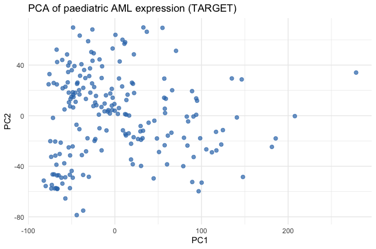
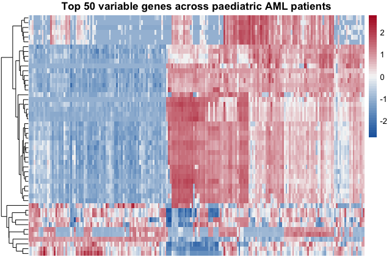

# Exploratory Gene-Expression Analysis of Paediatric Acute Myeloid Leukaemia (AML)

An unsupervised analysis of paediatric AML gene-expression data, using principal
component analysis (PCA) and hierarchical clustering to ask whether patients separate
into distinct molecular subgroups.

---

## Question

**Do paediatric AML patients separate into distinct subgroups based on their
gene-expression patterns?**

Acute myeloid leukaemia is a molecularly heterogeneous blood cancer — different
patients carry different driver mutations, which can produce different gene-expression
programmes. This project explores whether that heterogeneity is visible in an
unsupervised analysis of the most variable genes, without using any clinical or
mutation labels.

---

## Data

- **Source:** [cBioPortal](https://www.cbioportal.org/) — *Acute Myeloid Leukemia
  (TARGET, GDC 2025)*
- **Type:** mRNA expression, TPM-normalised
- **Original size:** ~40,000 genes × ~2,600 samples
- **Genes are identified by Entrez Gene ID** (the source file contained no gene-symbol
  column), so figures are labelled by numeric ID rather than gene name.

---

## Method

The analysis was run in R. The workflow:

1. **Load** the TPM expression matrix (`read_tsv`).
2. **Subset to 200 samples** for computational tractability on a first pass — enough to
   reveal structure while keeping PCA and the heatmap fast and legible.
3. **Clean:** removed genes with missing values and duplicate identifiers.
4. **Filter for signal:** kept the top 25% most variable genes, since genes that barely
   change across patients cannot help distinguish subgroups (~10,000 genes retained).
5. **Transform:** applied a log2 transformation so that a small number of very highly
   expressed genes did not dominate the analysis.
6. **PCA** on the processed matrix to visualise the main axes of variation.
7. **Hierarchical clustering heatmap** of the top 50 most variable genes to look for
   patient subgroups directly.

**Tools:** R · tidyverse · ggplot2 · pheatmap

---

## Results

### PCA

Each point is one patient, positioned by overall expression similarity. Patients are
not uniformly distributed: most form a dense cloud, with a clear spread along PC1 and a
small number of distinct outliers. This indicates that PC1 is capturing a genuine axis
of biological variation across patients, rather than noise.

### Clustering heatmap

Columns are patients, rows are genes; red = high expression, blue = low. The patients
separate into two main groups: a block of genes that is *low* (blue) in one group of
patients is *high* (red) in the others, with a smaller anti-correlated gene block
showing the opposite pattern. Finer sub-structure is visible within these groups.

---

## Interpretation

Both analyses point to the same conclusion: **paediatric AML patients separate into
distinct gene-expression subgroups.** This is consistent with the known molecular
heterogeneity of AML, where different subtypes run different transcriptional programmes.

**What this analysis shows:** that expression-based subgroups exist.
**What it does not yet show:** *what* those subgroups correspond to. Confirming whether
the clusters map onto specific AML subtypes, driver mutations, or clinical outcomes
would require integrating the clinical and mutation data — see *Next steps*.

---

## Next steps

- **Annotate the clusters:** overlay clinical / mutation data to test whether the
  expression subgroups correspond to known AML molecular subtypes.
- **Map Entrez IDs to gene symbols** to make the most variable genes interpretable.
- **Differential expression:** move from raw read counts to a formal DESeq2
  differential-expression workflow comparing subgroups (planned as a follow-up project).

---

## Repository contents

| File | Description |
|------|-------------|
| `aml_expression_analysis.R` | Full analysis script (load → clean → PCA → heatmap) |
| `pca_plot.png` | PCA figure |
| `heatmap.png` | Clustering heatmap figure |
| `README.md` | This file |

---

*Data accessed via cBioPortal (TARGET AML, GDC 2025). This is an independent
exploratory analysis for learning and portfolio purposes.*
